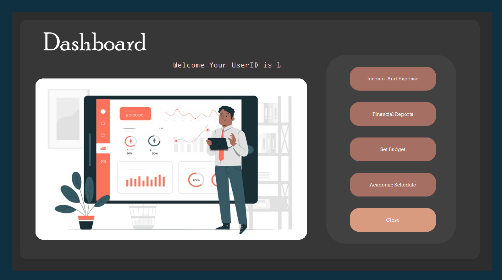
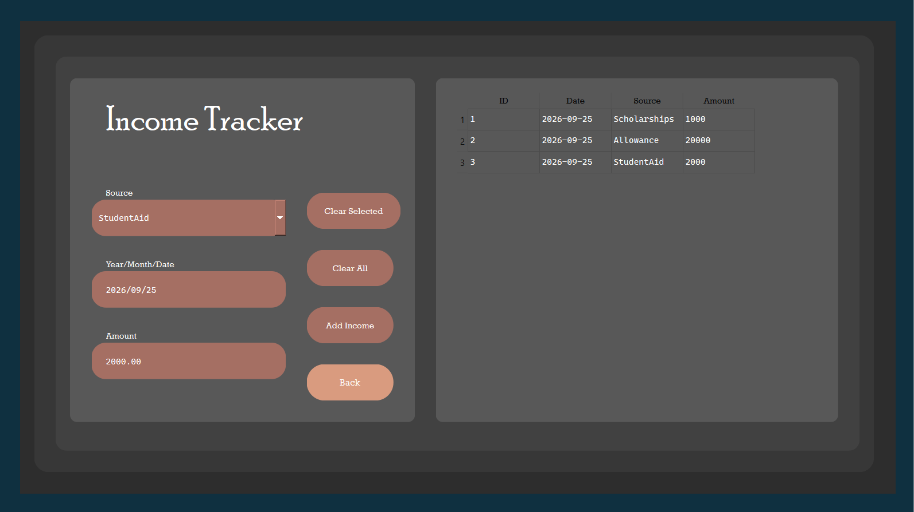
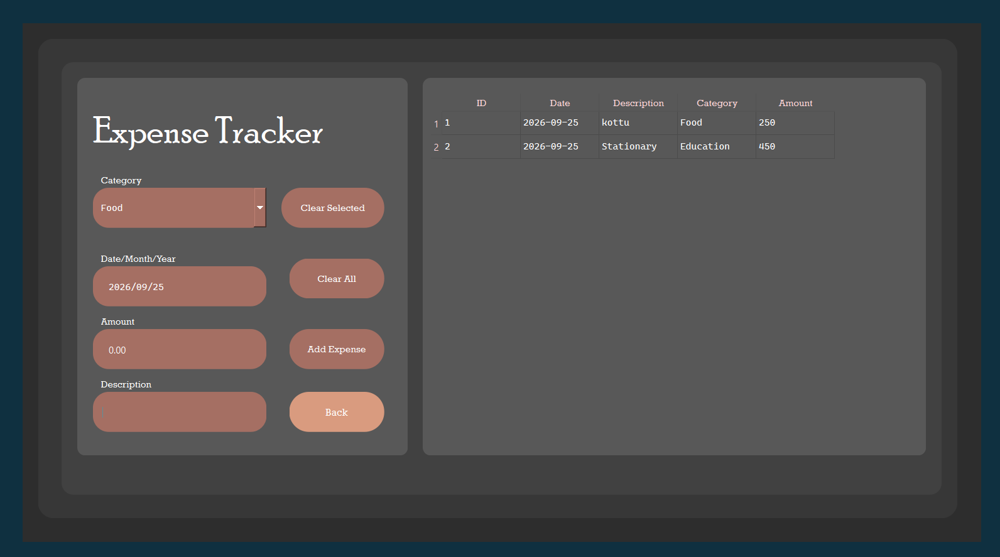
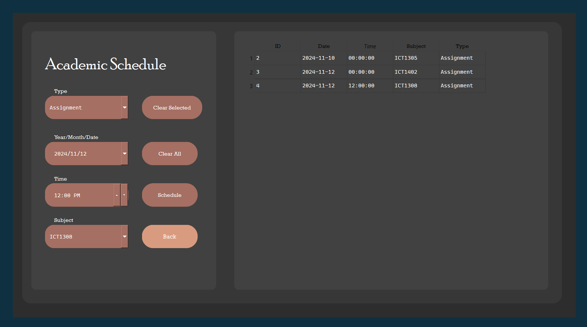
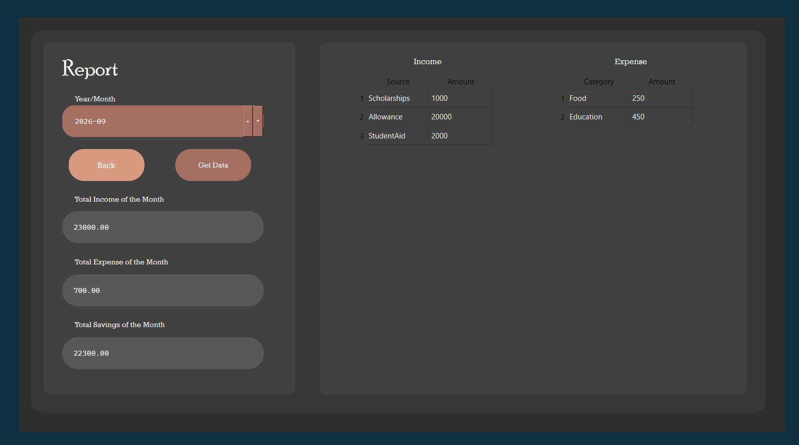

# Personal Organizer

A robust desktop application built with C++ and the Qt framework. This application helps users manage their daily lives by tracking finances, setting budgets, managing academic schedules, and generating monthly reports. It uses a local SQLite database for secure and efficient data storage.

## ✨ Features

- **User Authentication:** Secure login and registration system with SHA-256 password hashing.
- **Income & Expense Tracker:** Log and categorize your daily expenses and income sources.
- **Budget Management:** Set monthly budget limits for different categories (Food, Entertainment, Traveling, etc.) and ensure you don't exceed them.
- **Academic Scheduler:** Schedule lectures and assignments. Includes an automatic reminder system for upcoming assignments.
- **Financial Reports:** Generate monthly financial summaries displaying total income, total expenses, and net savings.

## 📸 Screenshots

### Dashboard

### Income Tracker

### Expense Tracker

### Academic Scheduler

### Monthly Report

## 🛠️ Technology Stack

- **Language:** C++17
- **Framework:** Qt (Widgets, Core, GUI, SQL)
- **Database:** SQLite
- **Security:** `QCryptographicHash` (SHA-256)

## 📁 Project Structure

- `src/` - Contains all C++ source code (`.cpp`) and header (`.h`) files.
- `ui/` - Contains Qt Designer forms (`.ui`).
- `res/` - Contains Qt Resource files (`.qrc`) and application images.

## 🚀 Getting Started

### Prerequisites
- Qt Creator and the Qt SDK installed (Qt 5 or Qt 6 compatible).
- A C++17 compatible compiler (e.g., MinGW, MSVC, GCC).

### Build and Run
1. Open `Personal_Organizer.pro` in Qt Creator.
2. Configure the project using your default desktop kit.
3. Click **Build > Run qmake** to process the project files and resources.
4. Click **Run** (or press `Ctrl+R`) to build and launch the application.
5. The application will automatically create the required `users.db` SQLite database in its working directory on the first run.
